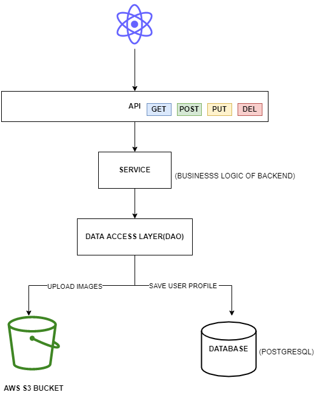

# aws-image-uploader

<br />
<p align="center">

<!--  -->

<h2 align="center">AWS IMAGE UPLOADER</h2>

<h3 align="center">
 Tools: AWS S3 Services, Java, Node.js, React, Spring, SpringBoot, PostgreSQL

</h3>
<br />
</p>

## Table of Contents

- [Project Description](#project-description)
- [User story](#user-story)
- [App URL](#app-url)
- [Wireframe](#wireframe)
- [Demo](#demo)
- [Installation](#installation)
- [Contributing](#contributing)
- [License](#license)

## Project Description

A user profile application to upload images from a frontend app built using react to store images in an Amazon AWS S3 Bucket and user data in a postgreSQL databse. The S3 services provides scalable storage infrastructure and can be used to store images, videos, text and files.

## User story

```
As a user,
I want to be able to search, add and save user profiles to database.
I want to be able to upload profile images for specific user.
So that I have quick access to a face book of user profiles.
```

## App URL

Link to website: {in the works...}

## Wireframe

Bootstrapping our application together with springboot- our backend and react frontend will communicate via API calls with user data saving to our postgreSQL database and profile image leveraging AWS S3 API storing user profile image.



## Demo


<br>

## Installing and running the code on computer

### Prerequisites

node.js  
 PostgreSQL

### Installing and running

1. clone the repo.
2. cd to the repo directory.
3. start your spring backend server by cd in target directory and runninng 'jar' package.
```
java -jar .\aws-image-uploader-0.0.1-SNAPSHOT.jar
```
4. install npm packages from package.json folder.
```
npm install
```
5. run the app in command-line.
```
npm start
```
6.  react will automatically open a http://localhost:3000/ on browser.

## Contributing

Collaboration is welcomed! For pull requests and changes, please open an issue first to discuss what changes you would like to make.

## License

Distributed under the MIT License.
